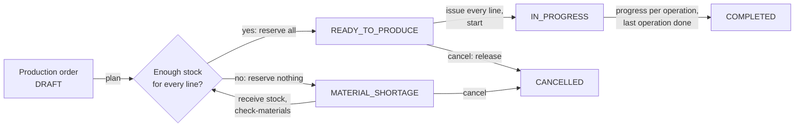

# Manuflow — Manufacturing Production & Inventory Backend

This project is a student/personal simulation of an internal manufacturing management system. It models common workflows such as BOM management, material planning, inventory reservation, production planning, and workshop progress tracking. It is not a production ERP, and the author does not claim professional manufacturing experience.

> Status: **MVP complete (Phases 1–7)** plus the demo UI (Phase 8, React) and a read-only AI
> assistant (Phase 9, off unless an API key is configured).

## The workflow



1. A production manager creates an order for a product; the active BOM is exploded into material needs, always rounded up (`58.8 → 59` bolts).
2. Planning reserves every material line or none at all; a shortage reserves nothing and lists every missing quantity.
3. The warehouse receives stock, issues reserved material to the order and takes back what was not used; every movement writes one ledger line.
4. Workers report good and rejected units per operation, only at their own work center; an operation can never process more than the previous one passed.
5. The dashboard flags orders at risk, work centers where at-risk work piles up, and materials below their minimum.

## Quick start

Requirements: Docker Desktop (Compose v2), `curl` and `jq` for the demo.

```bash
cp .env.example .env          # placeholder values; set SEED_DEMO_PASSWORD to your own
docker compose up -d --build  # MySQL 8.0 + API; migrations run on API start
curl http://localhost:8000/health
# {"status":"ok","database":"ok"}

docker compose exec api python -m seed   # demo shop with 10 days of history
```

Web UI: <http://localhost:5173> (the `web` service; log in with a demo account below).
OpenAPI docs: <http://localhost:8000/docs>. MySQL is exposed on host port `3307`.

The UI holds no business rules: menus follow the `permissions` of `/auth/me`, order
buttons are exactly the `allowed_actions` the API returns, limits and progress come from
the API, and every form sends a fresh `Idempotency-Key` (reused only on a retry). See
[`frontend/README.md`](frontend/README.md).

The seed only runs with `ENV=dev`, refuses a database that already holds data, and goes
through the HTTP API with a clock that starts ten days ago, so the ledger, the audit log
and every order state are produced exactly as in real use. Demo accounts share the
password in `SEED_DEMO_PASSWORD`:

| Account | Role | Work center |
| --- | --- | --- |
| `demo.admin` | ADMIN | — |
| `demo.manager` | PRODUCTION_MANAGER | — |
| `demo.warehouse` | WAREHOUSE | — |
| `demo.cut`, `demo.cnc`, `demo.weld`, `demo.paint`, `demo.qc` | WORKER | WC-CUT, WC-CNC, WC-WELD, WC-PAINT, WC-QC |

What the seed leaves (ids on a fresh database):

| Order | Product | State | Why it is there |
| --- | --- | --- | --- |
| 1 | FRAME-A × 20 | COMPLETED (19 good) | one frame scrapped at QC |
| 2 | FRAME-A × 30 | CANCELLED | reservation released |
| 3 | FRAME-A × 60 | IN_PROGRESS, **OVERDUE** | due yesterday, still at welding |
| 4 | FRAME-A × 100 | IN_PROGRESS, **AT_RISK** | due in 8 h, welding 40/100 |
| 5 | BRACKET-B × 50 | IN_PROGRESS, on track | at CNC |
| 6 | FRAME-A × 40 | READY_TO_PRODUCE | reserved, not issued |
| 7 | FRAME-A × 400 | **MATERIAL_SHORTAGE** | short of steel only |
| 8 | BRACKET-B × 120 | DRAFT | not planned |

WC-WELD is flagged as a **bottleneck** (two at-risk orders), and STEEL-001 and BOLT-M8 are
below their minimum stock.

Without the seed, create the first admin yourself (the API cannot create one); the
password is prompted for, never passed on the command line:

```bash
docker compose exec api python -m app.cli create-user --username admin \
    --full-name "System Admin" --role ADMIN
```

## Five-minute demo

Order 7 goes from shortage to completed. In the UI: log in as `demo.manager` (dashboard,
order 7 short of steel), `demo.warehouse` (Tồn kho → receive 200 kg STEEL-001, order 7 →
re-check, issue every line), `demo.manager` (start), then `demo.cut`, `demo.weld`,
`demo.paint`, `demo.qc` (Work center của tôi → report), and `demo.admin` (audit log).
The same flow runs as a browser test (`cd frontend && E2E_PASSWORD=... npm run e2e`) and,
through the API, as `tests/integration/test_seed.py::test_five_minute_demo_runs_on_the_seed`.
With `curl`:

```bash
API=http://localhost:8000/api/v1
PASSWORD=...   # the value of SEED_DEMO_PASSWORD
token() { curl -s $API/auth/login -H 'Content-Type: application/json' \
  -d "{\"username\":\"$1\",\"password\":\"$PASSWORD\"}" | jq -r .access_token; }
call() { # call <user> <method> <path> [json]
  curl -s -X "$2" "$API$3" -H "Authorization: Bearer $(token "$1")" \
    -H 'Content-Type: application/json' -H "Idempotency-Key: demo-$(date +%s%N)" \
    ${4:+-d "$4"}; }

# 1. The shortage: every line with required, available and shortage.
call demo.manager GET /production-orders/7/materials | jq '.items[] | {material_code, required_quantity, shortage_quantity}'

# 2. Receive steel (STEEL-001 is material 1), then re-check: all lines reserved at once.
call demo.warehouse POST /inventory/receipts '{"material_id": 1, "quantity": "200", "reference": "GRN-DEMO"}' | jq -c '{material_code, on_hand_quantity, available_quantity}'
call demo.manager POST /production-orders/7/check-materials | jq '{status, reserved}'

# 3. Issue every reserved line and start production.
for line in $(call demo.warehouse GET /production-orders/7/materials | jq -r '.items[] | "\(.id):\(.reserved_quantity)"'); do
  call demo.warehouse POST /inventory/issues "{\"order_material_id\": ${line%%:*}, \"quantity\": \"${line#*:}\"}" | jq -c '{material_code, on_hand_quantity}'
done
call demo.manager POST /production-orders/7/start | jq .status

# 4. Report progress with scrap, each worker at their own station.
ops=$(call demo.manager GET /production-orders/7/operations)
op() { echo "$ops" | jq -r ".items[] | select(.sequence == $1) | .id"; }
progress='{operation_type, status, good_quantity, rejected_quantity, limit}'
call demo.cut   POST /production-operations/$(op 10)/progress '{"good_delta": 400}' | jq -c "$progress"
call demo.weld  POST /production-operations/$(op 20)/progress '{"good_delta": 400}' | jq -c "$progress"
call demo.paint POST /production-operations/$(op 30)/progress '{"good_delta": 398, "rejected_delta": 2}' | jq -c "$progress"
call demo.weld  POST /production-operations/$(op 40)/progress '{"good_delta": 1}' | jq .error.code   # OPERATION_NOT_FOUND: not their station

# 5. Risks and bottlenecks, then finish at QC.
call demo.manager GET /dashboard/risks | jq '.items[] | {production_order, risk, message}'
call demo.manager GET /dashboard/bottlenecks | jq '.items[] | select(.bottleneck)'
call demo.qc    POST /production-operations/$(op 40)/progress '{"good_delta": 396, "rejected_delta": 2}' | jq -c "$progress"
call demo.manager GET /production-orders/7 | jq '{status, completed_quantity}'   # COMPLETED, 396
```

## AI assistant (optional)

Ask questions such as "Tuần này có làm được 150 FRAME-A không?" or "Lệnh nào đang trễ và vì
sao?" with `POST /api/v1/assistant/ask` or the **Trợ lý** page of the UI. Set `ASSISTANT_API_KEY` (and optionally
`ASSISTANT_MODEL`) in `.env` to switch it on; without a key it answers 503 and nothing
else changes. **Free, local option:** install [Ollama](https://ollama.com), run
`ollama pull qwen2.5:7b`, and set `ASSISTANT_PROVIDER=ollama`, `ASSISTANT_MODEL=qwen2.5:7b`
(the API reaches the host at `http://host.docker.internal:11434/v1`); no key is needed.

- Six **read-only** tools (BR-AI-01): material requirements, a what-if of the
  all-or-nothing reservation, order status, order risks, bottlenecks, low stock. There is
  no tool that writes; asked to change something, the assistant names the page or endpoint
  (BR-AI-04).
- Each tool runs **as the caller**, through the same service and permission as the REST
  endpoint with the same data, and returns the API's own response model (BR-AI-02/03): a
  worker asking about risks gets the same 403 as the API.
- Numbers in the answer must come from the tools; any other number is returned in
  `ungrounded_numbers` with `grounded: false`.
- `app/assistant/eval_questions.json` holds 20 evaluation questions with the tools and
  facts expected (BR-AI-05); a test checks those facts against the seeded data, and
  `python -m app.assistant.evaluate` runs them against the real model. Latest result with
  the free local `qwen2.5:7b`: **19/20** ([`docs/assistant-eval.md`](docs/assistant-eval.md)).

## Key design decisions

The spec (`docs/requirements.md`) holds the business rules (`BR-xx`) and its decision table
(`D-xx`); `docs/decisions.md` records the gaps found in the spec and how each was settled
(`C-01`…`C-15`). The ones that matter most:

- **All-or-nothing reservation** (BR-INV-05, D-08): a shortage reserves nothing, so stock is never stranded on half-planned orders.
- **Fixed lock order** (B12): idempotency key → order → order lines → stock rows by ascending `material_id`, so two plans on the same steel serialise instead of deadlocking.
- **Ledger plus DB constraints** (BR-INV-02/03/04, D-20): each balance change writes one append-only ledger line in the same transaction; `CHECK` constraints and triggers are the safety net.
- **Idempotency in the same transaction** (D-22): the key row, the change and the stored response commit together.
- **Decimal quantities as strings** (D-05): `quantize_up` is the only rounding function; quantities with too many decimals are rejected, never rounded silently.
- **One writer of order status** (BR-PO-02): only the production service changes it, through the state table in `app/domain/order_state.py`; a test enforces it.
- **Workers see only their station** (BR-AUTH-03): anything outside is a 404, not a 403.

## Tests

```bash
docker compose exec api pytest -q                      # everything (real MySQL 8)
docker compose exec api pytest -q tests/unit           # pure domain logic, < 5 s, no DB
docker compose exec api pytest -q -m concurrency       # two real connections on two threads
docker compose exec api python scripts/rule_coverage.py  # BR-xx -> tests
docker compose exec api sh -c 'ruff check . && ruff format --check . && mypy'
cd frontend && npm test && npm run typecheck && npm run lint   # UI components (Vitest)
cd frontend && E2E_PASSWORD=... npm run e2e                     # demo in a real browser (Playwright, needs the seeded stack)
```

| Level | What | How |
| --- | --- | --- |
| Unit | `app/domain/` (BOM explosion, state machine, progress, risk) | no DB |
| Integration / API | services and routes, error format, permissions | MySQL `manuflow_test`, rebuilt by Alembic each run, every test rolled back |
| Concurrency | row locks, idempotency races | committed data on two threads, cleaned afterwards |
| Property | random receive / plan / issue / return / cancel / start sequences | Hypothesis; checks BR-INV-02 and BR-INV-04 after every step |

SQLite is not used: row locking and `CHECK` constraints must behave exactly like MySQL.
The concurrency tests prove, for example, that two plans of 80 and 50 units against 100 in
stock leave exactly one order READY and 20 available. Every business rule has a test that
cites it by name; CI fails if a rule of Phases 1–7 has none. Each pull request also lists
a mutation check: the code is broken on purpose and the tests must fail.

CI (GitHub Actions) runs ruff, mypy (strict), `pip-audit`, the rule-coverage check and the
full suite against MySQL 8.0 on every pull request. The security review against B16 is in
[`docs/security-review.md`](docs/security-review.md).

## Project layout

```
backend/
  app/
    api/          thin routes, error mapping, dependencies
    core/         settings, security, permissions, request ID, logging, clock
    db/           declarative base, engine, session, transactions
    domain/       pure business logic, no I/O
    models/       SQLAlchemy models
    repositories/ queries and row locks, never commit
    schemas/      Pydantic request/response models
    services/     use cases; each owns one DB transaction
  alembic/        migrations (run with a separate DDL user)
  seed/           demo shop
  scripts/        rule -> test coverage report
  tests/          unit/ api/ integration/ concurrency/
frontend/         React + TypeScript demo UI; types generated from docs/openapi.json
  e2e/            Playwright run of the five-minute demo
docker/mysql/init/  creates databases and least-privilege DB users
docs/               requirements, decisions, OpenAPI snapshot, security review, AI usage, interview notes
```

## AI-assisted development

Built with Claude Code under the rules in [`CLAUDE.md`](CLAUDE.md) and the Git skill in
`.claude/skills/git-pr-workflow/`:

- one branch and one pull request per unit of work, with CI required before merge and no direct pushes to `main`;
- the AI reports after every unit with the tests it actually ran and their real output;
- every business rule has a test, and each PR lists a mutation check;
- the owner reviews and merges; merging is the approval to start the next phase.

[`docs/ai-usage.md`](docs/ai-usage.md) logs the real mistakes caught along the way (what
the AI wrote, what caught it, how it was fixed, which PR), for example tests that passed
for the wrong reason, a due date stored without UTC normalisation, and a scan test that
checked nothing. [`docs/interview-notes.md`](docs/interview-notes.md) maps common
interview questions to the code and tests that answer them.

## Known limitations

- **Bottlenecks are not capacity planning.** There is no capacity or shift data, so `/dashboard/bottlenecks` shows where unfinished units and at-risk orders pile up, not how loaded the machines really are.
- **A completed operation cannot be corrected** (C-10). Once an operation is COMPLETED, progress reports on it are rejected; a wrong count has to be explained outside the system.
- **Material alerts are suggestions.** A MATERIAL_SHORTAGE order listed as a re-check candidate stays in that state until someone runs `check-materials` (D-09).
- Dashboard figures are computed on request with no cache; fine for a small shop, not for thousands of open orders.
- The seed cannot be undone: the ledger and the audit log are append-only by design. Recreate the database volume to start over.

## Out of scope

Multi-level BOMs, several warehouses or bin locations, lots and serial numbers,
purchasing, sales orders, costing, finite-capacity scheduling, rework orders, shift
calendars, unit conversion, multi-tenancy and real-time push. Security items left to a
real deployment: refresh tokens, HTTPS (a reverse proxy's job) and SSO.

A real plant would add, in roughly this order: multi-level BOMs and several stock
locations, lots for traceability, capacity-based scheduling, integration with the ERP
that owns purchasing and sales, and an async job runner for reports.
