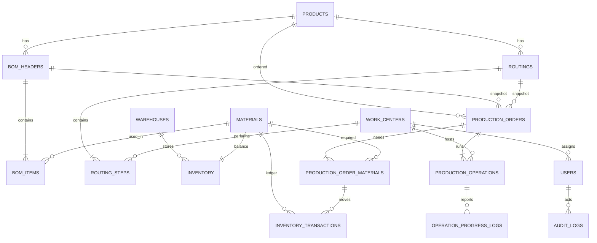

# Master Prompt v2 — Backend Quản lý Sản xuất & Tồn kho

Sep 30, 2026 · @humanoid

## Cách dùng tài liệu này

Bản v2 chốt trước mọi điểm mơ hồ về nghiệp vụ trong v1, để AI xây dựng theo quy tắc cố định thay vì dừng lại hỏi hoặc tự bịa. Tài liệu gồm hai phần lưu thành hai file trong repository, kèm một skill Git:

| Phần | Lưu thành | Ai đọc | Thay đổi khi nào |
| --- | --- | --- | --- |
| A. Quy tắc làm việc cho AI | `CLAUDE.md` (gốc repo) | AI coding assistant, mọi phiên | Hiếm khi |
| B. Đặc tả yêu cầu | `docs/requirements.md` | AI, bạn, người phỏng vấn | Khi một quyết định thay đổi |
| Skill Git | `.claude/skills/git-pr-workflow/SKILL.md` và `.claude/settings.json` | Claude Code, sau mỗi phần việc | Hiếm khi |

Mỗi quy tắc nghiệp vụ có mã `BR-xx`, mỗi điểm mơ hồ đã chốt có mã quyết định `D-xx`. Comment trong code, commit message và tên test nên trích các mã này, ví dụ `test_br_inv_05_reservation_is_all_or_nothing`. Khả năng truy vết này là điều biến dự án từ CRUD thành một hệ thống nghiệp vụ chứng minh được.

Thay đổi so với v1:

- Thêm bảng quyết định (B3) chốt 25 câu hỏi mở: máy trạng thái, xuất kho và giữ hàng, quy tắc hủy, công thức tiến độ, hàng lỗi, snapshot BOM, một kho, làm tròn.
- Thêm các entity còn thiếu: routing, dòng vật tư của lệnh, log tiến độ, idempotency key, bộ đếm số lệnh.
- Thay quy tắc tĩnh "tiến độ < 50%" bằng quy tắc có tính đến thời gian, và tách "lệnh có nguy cơ trễ" khỏi "điểm nghẽn tại work center".
- Bỏ endpoint giữ hàng độc lập; chỉ giữ hàng thông qua lệnh sản xuất.
- Thêm ma trận phân quyền, có giới hạn phạm vi dữ liệu cho WORKER.
- Đưa kiểm thử vào từng phase kèm Definition of Done, và vạch rõ đường cắt MVP.
- Tách quy tắc cho AI khỏi đặc tả, và thêm skill tự tạo nhánh, commit, push và mở Pull Request sau mỗi phần việc.

## Part A — CLAUDE.md (quy tắc làm việc cho AI)

Bạn là kỹ sư backend senior kiêm người review trong một dự án mô phỏng hệ thống nội bộ của công ty sản xuất. Chủ dự án là sinh viên đang chuẩn bị ứng tuyển vị trí Python Internal Software Developer. Logic nghiệp vụ đúng và toàn vẹn dữ liệu quan trọng hơn số lượng tính năng hay giao diện.

### Nguồn sự thật

1. `docs/requirements.md` định nghĩa quy tắc nghiệp vụ (`BR-xx`) và quyết định (`D-xx`). Làm đúng theo đó.
2. Nếu code và đặc tả mâu thuẫn: dừng lại và báo mâu thuẫn. Không âm thầm chọn một bên.
3. Không tự đặt ra quy tắc ảnh hưởng đến số lượng tồn kho, trạng thái lệnh, phân quyền hoặc toàn vẹn dữ liệu. Nếu đặc tả chưa có, hỏi đúng một câu cụ thể và đề xuất giá trị mặc định.
4. Khoảng trống nhỏ (đặt tên, kích thước trang, định dạng log): chọn mặc định hợp lý và ghi vào mục "Giả định" trong báo cáo.

### Vòng lặp làm việc cho mỗi phần việc

1. Bắt đầu phần việc bằng skill `git-pr-workflow` (mục A): tạo nhánh `phase-<n>/<slug>`.
2. Đọc các mục đặc tả liên quan và code hiện có trước khi viết. Liệt kê các file sẽ sửa.
3. Thực hiện thay đổi nhỏ nhất nhưng trọn vẹn: một use case, đầu cuối (model → migration → repository → service → route → test).
4. Logic nghiệp vụ nằm trong `services/`. Route chỉ validate input, kiểm tra quyền, gọi một method của service và map kết quả. Route không mở transaction và không chứa chuỗi `if` về trạng thái.
5. Viết hoặc cập nhật test trong cùng thay đổi. Một tính năng chưa có test cho `BR-xx` của nó thì chưa xong.
6. Chạy test, chạy `ruff` và `mypy` nếu đã cấu hình.
7. Tự review diff theo checklist bên dưới.
8. Kết thúc phần việc bằng skill `git-pr-workflow` (mục B): commit, push, tạo Pull Request, theo dõi CI, rồi báo cáo.

### Checklist tự review

- Mỗi thay đổi tồn kho có tạo đúng một dòng `inventory_transactions` cho mỗi vật tư, trong cùng DB transaction không?
- Các dòng có được khóa theo thứ tự cố định (`material_id` tăng dần) trước khi đọc số lượng để ra quyết định không?
- Gọi endpoint hai lần với cùng payload có làm tác động bị nhân đôi không?
- Quyền có được kiểm tra ở server, bao gồm giới hạn phạm vi dữ liệu của WORKER không?
- Số lượng có dùng `Decimal`, không bao giờ `float`?
- Khi có lỗi, database có giữ nguyên trạng thái không?
- Có thứ gì nhạy cảm (mật khẩu, token, secret) bị log hoặc trả về không?

### Định dạng báo cáo sau mỗi phần việc

- **Đã thay đổi:** các file và tác dụng của từng thay đổi.
- **Quy tắc nghiệp vụ:** các `BR-xx` / `D-xx` đã triển khai hoặc chạm tới.
- **Kiểm thử:** tên test mới, lệnh đã chạy và kết quả thật (số pass/fail). Nếu chưa chạy test, ghi "CHƯA CHẠY" và lý do.
- **Edge case** đã xét và những gì chưa bao phủ.
- **Ghi chú bảo mật.**
- **Giả định** cho các khoảng trống nhỏ.
- **Git:** nhánh, commit, link PR, trạng thái CI (theo mẫu B7 của skill).
- **Bước tiếp theo** đề xuất.

### Quy tắc cứng

- Không bao giờ nói test đã pass nếu chưa chạy trong phiên này và chưa thấy output.
- Không nói một phase đã xong khi còn mục nào trong Definition of Done chưa đạt.
- Không bắt đầu phase tiếp theo khi chủ dự án chưa duyệt. PR được merge vào `main` là tín hiệu duyệt.
- Không push thẳng lên `main`, không force-push, không merge PR, không dùng `--no-verify`.
- Không thêm Redis, Celery, message queue, microservices, CQRS, event sourcing, Kubernetes.
- Không thêm thư viện mà không nêu vấn đề cụ thể nó giải quyết.
- Không sửa test cho yếu đi để nó pass. Nếu test lộ ra vấn đề của đặc tả, hãy báo lại.
- Commit theo Conventional Commits và trích mã quy tắc, ví dụ `feat(inventory): all-or-nothing reservation` với dòng `Refs: BR-INV-05`.

## Part B — Đặc tả yêu cầu

## B1. Định vị, mục tiêu và phạm vi

Hệ thống biến một yêu cầu sản xuất thành một luồng có kiểm soát: bung BOM → kiểm tra vật tư → giữ hàng all-or-nothing → xuất kho → báo tiến độ theo từng công đoạn → hoàn thành. Mọi biến động kho và mọi thay đổi trạng thái đều truy vết được tới người thực hiện.

Câu định vị trong README (giữ nguyên văn tiếng Anh cho repo): "This project is a student/personal simulation of an internal manufacturing management system. It models common workflows such as BOM management, material planning, inventory reservation, production planning, and workshop progress tracking. It is not a production ERP, and the author does not claim professional manufacturing experience."

Hồ sơ công ty giả định để giữ tính thực tế: một xưởng sản xuất rời rạc nhỏ (gia công kim loại), một nhà máy, một kho nguyên vật liệu, 5 work center, lệnh sản xuất từ 10 đến 500 sản phẩm.

### Trong phạm vi

| Mảng | Bao gồm |
| --- | --- |
| Dữ liệu gốc | Sản phẩm, vật tư, work center, BOM một cấp có phiên bản, routing có phiên bản |
| Tồn kho | Một kho; nhập, giữ, nhả, xuất, trả, điều chỉnh; sổ cái giao dịch đầy đủ |
| Sản xuất | Lệnh sản xuất, máy trạng thái, snapshot BOM và routing, công đoạn, tiến độ có hàng lỗi |
| Giám sát | Rủi ro của lệnh (đúng tiến độ / có nguy cơ / quá hạn), điểm nghẽn work center, cảnh báo tồn thấp |
| Nền tảng | JWT, RBAC có giới hạn phạm vi cho WORKER, audit log, mutation idempotent, Docker Compose |

### Ngoài phạm vi (ghi rõ trong README)

BOM nhiều cấp, nhiều kho hoặc vị trí kệ, lô và số serial, mua hàng, đơn bán hàng, tính giá thành, lập lịch theo năng lực hữu hạn, lệnh làm lại (rework), lịch ca, quy đổi đơn vị tính, multi-tenant, đẩy dữ liệu thời gian thực.

### Đường cắt MVP

Nếu thiếu thời gian, dự án vẫn trọn vẹn và đủ để phỏng vấn sau Phase 7 (xem B18): xác thực, dữ liệu gốc, bung BOM, tồn kho có giữ hàng và xuất kho, máy trạng thái sản xuất, tiến độ, phát hiện rủi ro, có test ở mỗi phase. Frontend React (Phase 8) và trợ lý AI (Phase 9) là mục tiêu mở rộng, bị bỏ trước theo thứ tự ngược lại.

## B2. Thứ tự ưu tiên và công nghệ

Khi phải đánh đổi, ưu tiên theo thứ tự: đúng nghiệp vụ → toàn vẹn dữ liệu → transaction và đồng thời → phân quyền → test → API rõ ràng → audit → quan sát hệ thống → frontend → trợ lý AI.

| Tầng | Lựa chọn | Chi tiết cố định |
| --- | --- | --- |
| Ngôn ngữ | Python 3.12 | Type hint ở mọi nơi; `mypy --strict` cho `services/` |
| Web | FastAPI | Endpoint đồng bộ với session SQLAlchemy đồng bộ (transaction đơn giản hơn; đủ cho tải này) |
| ORM / migration | SQLAlchemy 2.x, Alembic | Kiểu `select()` của 2.0; mọi thay đổi schema là một migration, không dùng `create_all` ngoài test |
| Validate | Pydantic v2 | Số lượng là `Decimal` với `max_digits=18, decimal_places=4` |
| Database | MySQL 8.0.16+ (InnoDB) | Cần để `CHECK` constraint thực sự có hiệu lực; `utf8mb4`; isolation REPEATABLE READ (mặc định) |
| Driver | PyMySQL | Đơn giản, phổ biến |
| Xác thực | PyJWT, `pwdlib` với Argon2 (hoặc bcrypt) | Chỉ access token, hết hạn sau 30 phút; chưa có refresh token trong MVP |
| Test | pytest, HTTPX `TestClient`, MySQL trong Docker | Không dùng SQLite: hành vi khóa dòng và `CHECK` phải giống production |
| Chất lượng | ruff, mypy, pre-commit | CI trên GitHub Actions: lint + test với MySQL service container, chạy trên mọi Pull Request |
| Frontend (mở rộng) | React + TypeScript + Vite, Axios | Sinh type từ OpenAPI schema |
| Hạ tầng | Docker Compose: `api`, `db`, `web` | Không Redis, Celery, queue |
| Git | GitHub, GitHub CLI (`gh`) | Mỗi phần việc một nhánh và một PR; `main` được bảo vệ |

Vì sao dùng đồng bộ thay vì async: nghiệp vụ nặng về transaction nhưng tải thấp. Session đồng bộ giúp ranh giới transaction và khóa dòng dễ suy luận và dễ giải thích khi phỏng vấn. Chuyển sang async là một hướng mở rộng được ghi nhận, không phải yêu cầu.

## B3. Thuật ngữ và bảng quyết định

### Thuật ngữ

| Thuật ngữ | Nghĩa trong hệ thống |
| --- | --- |
| BOM | Định mức vật tư và số lượng cần để làm **một đơn vị** sản phẩm |
| Bung BOM (BOM explosion) | Nhân định mức BOM với số lượng lệnh, có tính hao hụt và làm tròn |
| Routing | Danh sách công đoạn có thứ tự (và work center tương ứng) để làm ra sản phẩm |
| Work center | Một nhóm máy hoặc một trạm, ví dụ `WC-WELD` |
| Công đoạn (operation) | Một bước routing được tạo cụ thể cho một lệnh sản xuất |
| Tồn thực (on hand) | Số lượng vật lý đang có trong kho |
| Đã giữ (reserved) | Số lượng đã hứa cho các lệnh nhưng chưa xuất |
| Khả dụng (available) | `on_hand − reserved`; phần lệnh mới được phép giữ |
| Xuất kho (issue, kitting) | Giao vật tư đã giữ cho sản xuất; giảm cả tồn thực và đã giữ |
| Đạt / lỗi (good / rejected) | Số đơn vị qua / không qua một công đoạn; hàng lỗi bị loại bỏ |
| Đã xử lý (processed) | `good + rejected` của một công đoạn |

### Bảng quyết định

Mỗi quyết định đóng một điểm mơ hồ của v1. Chỉ thay đổi quyết định bằng cách sửa bảng này; khi đó AI phải cập nhật code và test có trích mã tương ứng.

| Mã | Quyết định | Lý do |
| --- | --- | --- |
| D-01 | Một kho. Bảng `inventory` có cột `warehouse_id` cố định là kho mặc định, unique theo (`warehouse_id`, `material_id`). | Phân bổ nhiều kho thêm nhiều quy tắc mà ít giá trị phỏng vấn; giữ cột để mở rộng sau. |
| D-02 | Chỉ BOM một cấp. | Bung BOM tất định; BOM nhiều cấp là hướng mở rộng được ghi nhận. |
| D-03 | Mỗi sản phẩm có một phiên bản BOM ACTIVE. Phiên bản ACTIVE và RETIRED không sửa được; muốn thay đổi thì tạo phiên bản mới. | Lệnh sản xuất phải tái hiện được. |
| D-04 | Khi lập kế hoạch, lệnh lưu snapshot phiên bản BOM, phiên bản routing và các dòng vật tư đã tính. | Sửa dữ liệu gốc sau đó không làm thay đổi lệnh đang chạy. |
| D-05 | Số lượng cần = `qty_per_unit × order_qty × (1 + scrap_rate)`, làm tròn **lên** theo `decimal_places` của vật tư (0 với pcs, 3 với kg). `scrap_rate` mặc định 0. | Không thể xuất 0,4 con bu lông; làm tròn xuống gây thiếu hàng ở xưởng. |
| D-06 | Số lượng lệnh là số nguyên dương (đơn vị sản phẩm). Số lượng vật tư là số thập phân. | Sản xuất rời rạc. |
| D-07 | Bỏ trạng thái PLANNED. Hành động `plan` là nguyên tử và kết thúc ở READY\_TO\_PRODUCE hoặc MATERIAL\_SHORTAGE. | Một trạng thái chỉ tồn tại bên trong một transaction thì không ai quan sát được; bỏ nó giúp máy trạng thái đơn giản hơn. |
| D-08 | Giữ hàng all-or-nothing theo lệnh. Không giữ một phần. | Giữ một phần sẽ khóa tồn kho mà lệnh khác có thể dùng để hoàn thành. |
| D-09 | Muốn thoát MATERIAL\_SHORTAGE phải gọi rõ hành động `check-materials`. Nhập kho không bao giờ tự đổi trạng thái lệnh. | Không có tác dụng phụ ẩn trong luồng kho; dashboard liệt kê các lệnh nay đã đủ hàng. |
| D-10 | ISSUE luôn gắn với một dòng vật tư của lệnh và tiêu thụ phần đã giữ: `on_hand −q`, `reserved −q`. Xuất vượt phần còn giữ của dòng đó bị từ chối. | Mỗi gam xuất ra đều truy được về một lệnh. |
| D-11 | `start` yêu cầu mọi dòng vật tư của lệnh đã xuất đủ. | Giống kitting thực tế: không bắt đầu sản xuất khi thiếu linh kiện. |
| D-12 | Lệnh tự chuyển COMPLETED khi công đoạn cuối hoàn thành. | Hoàn thành là sự thật suy ra từ công đoạn, không phải ý kiến của người dùng. |
| D-13 | Được hủy từ DRAFT, MATERIAL\_SHORTAGE, READY\_TO\_PRODUCE. Hủy sẽ nhả phần còn giữ. Vật tư đã xuất do WAREHOUSE trả lại bằng RETURN. Không hủy được lệnh IN\_PROGRESS trong MVP. | Hủy giữa chừng cần hạch toán phế phẩm WIP, nằm ngoài phạm vi. |
| D-14 | Công đoạn 1 nhận đầu vào = số lượng lệnh. Công đoạn n chỉ được xử lý tối đa bằng số **đạt** của công đoạn n−1 tính đến lúc đó. Các công đoạn được chạy chồng lấn. | Sản xuất dạng dòng chảy mà không cần bộ lập lịch. |
| D-15 | Tiến độ được báo dạng delta (`good_delta`, `rejected_delta`) và ghi thêm vào log. Delta âm là điều chỉnh: chỉ PRODUCTION\_MANAGER, bắt buộc có lý do. | Lịch sử chỉ ghi thêm; các báo cáo đồng thời không ghi đè nhau. |
| D-16 | Hàng lỗi bị loại bỏ. Không làm lại, không tiêu hao thêm vật tư. Lệnh có thể kết thúc với số đạt ít hơn kế hoạch; `completed_quantity` ghi sản lượng thực tế. | Đơn giản hóa trung thực, ghi rõ trong README. |
| D-17 | Vai trò là enum cố định ở `users.role`; bản đồ quyền nằm trong code (`core/permissions.py`). Không có bảng roles/permissions. | Bốn vai trò cố định không cần RBAC động; ma trận quyền nằm gọn trong một file dễ review. |
| D-18 | Mỗi WORKER thuộc một work center và chỉ được báo tiến độ cho công đoạn tại work center đó. | Giới hạn phạm vi dữ liệu ở server, không chỉ kiểm tra vai trò. |
| D-19 | Dữ liệu gốc không bao giờ xóa cứng. `DELETE` đặt `active = false`. Từ chối vô hiệu hóa khi còn lệnh đang mở hoặc BOM ACTIVE tham chiếu tới. | Khóa ngoại và lịch sử luôn hợp lệ. |
| D-20 | Tồn khả dụng không bao giờ âm, không có ngoại lệ. ADJUSTMENT không được làm tồn thực thấp hơn phần đã giữ. | Được `CHECK` ở DB cưỡng chế, ngoài kiểm tra ở service. |
| D-21 | Số lệnh có dạng `PO-YYYY-NNNNN`, lấy từ dòng theo năm trong `document_sequences` được khóa `FOR UPDATE`. | Không trùng khi chạy đồng thời; bộ đếm rollback cùng transaction lỗi nên số không bị nhảy. |
| D-22 | Mọi endpoint POST/PATCH thay đổi dữ liệu nhận header `Idempotency-Key`; bắt buộc với nhập kho, xuất kho, trả kho, điều chỉnh, báo tiến độ và `plan`. Key được lưu 24 giờ theo người dùng. | Bấm đúp hoặc retry không được nhân đôi biến động kho. |
| D-23 | Thời gian lưu theo UTC (`DATETIME(6)`); frontend tự đổi múi giờ. `due_date` là ngày giờ. | Một quy tắc múi giờ cho mọi phép tính. |
| D-24 | Ngưỡng rủi ro là hằng số cấu hình: `RISK_GAP = 0.20`, `DUE_SOON_HOURS = 48`, `SHORTAGE_ALERT_DAYS = 3`. Đồng hồ được inject. | Quy tắc tất định, dễ test. |
| D-25 | Vật tư được coi là "tồn thấp" khi `available < minimum_stock`. | Khả dụng, không phải tồn thực, mới phản ánh phần kế hoạch còn dùng được. |

## B4. Tác nhân, vai trò và phân quyền

Bốn vai trò cố định (D-17). ADMIN cố ý không được biến động kho hay báo tiến độ sản xuất: đây là phân tách nhiệm vụ, và test chứng minh điều đó bằng mã 403.

| Vai trò | Người thực tế | Công việc chính trong hệ thống |
| --- | --- | --- |
| ADMIN | IT / người quản trị hệ thống | Người dùng, dữ liệu gốc, audit log |
| PRODUCTION\_MANAGER | Kế hoạch sản xuất / quản đốc | BOM, routing, lệnh sản xuất, điều chỉnh tiến độ |
| WAREHOUSE | Thủ kho | Nhập, xuất, trả, điều chỉnh kho |
| WORKER | Công nhân tại một work center | Báo tiến độ tại work center của mình |

### Ma trận quyền

| Quyền | ADMIN | PRODUCTION\_MANAGER | WAREHOUSE | WORKER |
| --- | --- | --- | --- | --- |
| `users:manage` | có | — | — | — |
| `master:read` (sản phẩm, vật tư, work center, BOM, routing) | có | có | có | có |
| `master:write` (sản phẩm, vật tư, work center) | có | có | — | — |
| `bom:write`, `routing:write` | — | có | — | — |
| `inventory:read` | có | có | có | — |
| `inventory:receive`, `inventory:adjust` | — | — | có | — |
| `inventory:issue`, `inventory:return` | — | — | có | — |
| `order:read` | có | có | có | work center của mình |
| `order:create`, `order:plan`, `order:start`, `order:cancel` | — | có | — | — |
| `order:check_materials` | — | có | có | — |
| `operation:report` | — | có | — | work center của mình |
| `operation:correct` (delta âm) | — | có | — | — |
| `dashboard:read` | có | có | có | — |
| `audit:read` | có | — | — | — |

### Quy tắc phân quyền

- **BR-AUTH-01** Vai trò và danh tính người dùng chỉ lấy từ JWT đã xác minh (`sub` = user id). Mọi `user_id`, `role` hay `created_by` trong body đều bị bỏ qua hoặc từ chối.
- **BR-AUTH-02** Mỗi route khai báo quyền bằng đúng một dependency, ví dụ `Depends(require("order:plan"))`. Route không khai báo quyền sẽ làm fail một test quét router.
- **BR-AUTH-03** Phạm vi dữ liệu: với WORKER, service lọc công đoạn và lệnh theo `users.work_center_id`. Truy cập công đoạn của work center khác trả về 404 (không phải 403) để không dò được ID.
- **BR-AUTH-04** Người dùng bị vô hiệu hóa không đăng nhập được, và token cũ của họ bị từ chối ở request kế tiếp (user được tải lại mỗi request).
- **BR-AUTH-05** Đăng nhập sai trả về một thông báo chung. Sai 5 lần trong 15 phút thì khóa tài khoản 15 phút.

## B5. Dữ liệu gốc, BOM và routing

### Sản phẩm, vật tư, work center

- **BR-MD-01** `product_code`, `material_code` và `work_center.code` là duy nhất, khớp `^[A-Z0-9-]{3,32}$`, và không sửa được sau khi tạo.
- **BR-MD-02** Vật tư có `unit` (một trong `kg`, `pcs`, `m`, `l`), `decimal_places` (0–4, `pcs` bắt buộc 0) và `minimum_stock ≥ 0`. Không có quy đổi đơn vị.
- **BR-MD-03** Sản phẩm được sản xuất theo đơn vị `pcs`.
- **BR-MD-04** Vô hiệu hóa theo D-19. Bản ghi đã vô hiệu hóa không dùng được trong BOM, routing hay lệnh mới.

### BOM

Phiên bản BOM có trạng thái DRAFT → ACTIVE → RETIRED (D-03).

- **BR-BOM-01** `qty_per_unit > 0`, tối đa 4 chữ số thập phân; `0 ≤ scrap_rate < 1`.
- **BR-BOM-02** Mỗi vật tư xuất hiện tối đa một lần trong một phiên bản BOM (unique constraint trên `bom_header_id, material_id`).
- **BR-BOM-03** Chỉ phiên bản DRAFT sửa được. Kích hoạt cần ít nhất một dòng, mọi vật tư đang active, và phiên bản ACTIVE cũ được chuyển RETIRED trong cùng transaction.
- **BR-BOM-04** Mỗi sản phẩm có tối đa một phiên bản ACTIVE. Cưỡng chế ở service bằng khóa dòng sản phẩm, và ở DB bằng cột sinh (generated column) `active_flag` có thể null cùng unique index trên (`product_id`, `active_flag`).

### Service bung BOM

`calculate_material_requirements(product_id: int, quantity: int, bom_header_id: int | None = None) -> list[MaterialRequirement]`

Phần tính toán nằm trong hàm thuần `explode(items, quantity)` không truy cập database, nên được unit test độc lập. Service lo tải dữ liệu, validate rồi gọi hàm này.

| Trường hợp | Kết quả |
| --- | --- |
| Không có sản phẩm | 404 `PRODUCT_NOT_FOUND` |
| Sản phẩm đã vô hiệu hóa | 409 `PRODUCT_INACTIVE` |
| Không có BOM ACTIVE (và không truyền phiên bản) | 409 `NO_ACTIVE_BOM` |
| Số lượng không phải số nguyên dương | 422 `INVALID_QUANTITY` |
| Một vật tư trong BOM đã vô hiệu hóa | 409 `MATERIAL_INACTIVE` kèm mã vật tư |
| Thành công | Mỗi vật tư một dòng, sắp theo `material_code`: `material_id, material_code, unit, qty_per_unit, scrap_rate, required_quantity` |

- **BR-BOM-05** `required_quantity = qty_per_unit × quantity × (1 + scrap_rate)`, tính bằng `Decimal` và làm tròn **lên** (`ROUND_CEILING`) theo `decimal_places` của vật tư (D-05).

Ví dụ mẫu (dùng làm fixture test đầu tiên):

| Vật tư | Đơn vị | Số lẻ | Định mức | Hao hụt | Lệnh 100 | Lệnh 7 |
| --- | --- | --- | --- | --- | --- | --- |
| STEEL-001 | kg | 3 | 2.0000 | 0.02 | 204.000 | 14.280 |
| BOLT-M8 | pcs | 0 | 8 | 0.05 | 840 | 59 (58.8 làm tròn lên) |
| PAINT-RED | kg | 3 | 0.2000 | 0 | 20.000 | 1.400 |

### Routing

Cùng vòng đời DRAFT → ACTIVE → RETIRED và quy tắc một phiên bản ACTIVE như BOM.

- **BR-RT-01** Routing có ít nhất một bước; giá trị `sequence` là duy nhất trong mỗi phiên bản (10, 20, 30 …).
- **BR-RT-02** Mỗi bước có `operation_type` (`CUTTING`, `CNC`, `WELDING`, `PAINTING`, `ASSEMBLY`, `QC`) và một work center đang active.
- **BR-RT-03** Bước cuối phải là `QC`. Nếu không, kích hoạt thất bại với 409 `ROUTING_MUST_END_WITH_QC`.

Routing mẫu cho sản phẩm `FRAME-A`: 10 CUTTING @ WC-CUT → 20 CNC @ WC-CNC → 30 WELDING @ WC-WELD → 40 PAINTING @ WC-PAINT → 50 QC @ WC-QC.

## B6. Tồn kho và giữ hàng

Tồn kho gồm một bảng số dư và một sổ cái chỉ ghi thêm. Số dư là bản cache của sổ cái; hai bên phải luôn khớp nhau.

- **BR-INV-01** Bảng `inventory` lưu `on_hand_quantity` và `reserved_quantity` cho mỗi vật tư. `available = on_hand − reserved` được tính, không lưu. Dòng tồn kho giá trị 0 được tạo trong cùng transaction với vật tư.
- **BR-INV-02** Ràng buộc DB: `CHECK (on_hand_quantity >= 0)`, `CHECK (reserved_quantity >= 0)`, `CHECK (reserved_quantity <= on_hand_quantity)` (D-20). Service kiểm tra trước và trả lỗi rõ ràng; constraint là lưới an toàn.
- **BR-INV-03** Mỗi thay đổi số dư ghi đúng một dòng `inventory_transactions` cho mỗi vật tư trong cùng DB transaction, với `on_hand_delta`, `reserved_delta` có dấu và số dư sau thay đổi. Dòng sổ cái không bao giờ bị sửa hay xóa.
- **BR-INV-04** Bất biến đối soát, có test và có endpoint cho admin: với mọi vật tư, `SUM(on_hand_delta) = on_hand_quantity` và `SUM(reserved_delta) = reserved_quantity`.

### Các loại giao dịch

| Loại | Tồn thực | Đã giữ | Ai kích hoạt | Cần dòng vật tư của lệnh | Quy tắc thêm |
| --- | --- | --- | --- | --- | --- |
| RECEIVE | +q | 0 | WAREHOUSE | Không | `q > 0`; số chứng từ nhà cung cấp tùy chọn |
| RESERVE | 0 | +q | Hệ thống (plan, check-materials) | Có | Chỉ qua thuật toán giữ hàng |
| RELEASE | 0 | −q | Hệ thống (cancel) | Có | Nhả phần còn giữ của dòng |
| ISSUE | −q | −q | WAREHOUSE | Có | `q ≤ line.reserved_quantity` (phần còn giữ; D-10) |
| RETURN | +q | 0 | WAREHOUSE | Có | `q ≤ line.issued − line.returned` |
| ADJUSTMENT | ±q | 0 | WAREHOUSE | Không | Bắt buộc lý do; kết quả phải giữ `on_hand ≥ reserved` |

Số lượng tuân theo `decimal_places` của vật tư; số có nhiều chữ số lẻ hơn bị từ chối với 422, không bao giờ tự làm tròn ngầm.

### Thuật toán giữ hàng (dùng cho `plan` và `check-materials`)

Trong một DB transaction:

1. Khóa dòng lệnh (`SELECT … FOR UPDATE`) và kiểm tra trạng thái cho phép hành động.
2. Lấy các dòng vật tư: `plan` bung BOM và ghi `production_order_materials`; `check-materials` dùng lại các dòng đã snapshot.
3. Khóa các dòng tồn kho của mọi vật tư theo thứ tự `material_id` tăng dần (`FOR UPDATE`). Thứ tự cố định ngăn deadlock giữa hai lệnh dùng chung vật tư.
4. Với mỗi dòng tính `available` và `shortage = max(0, required − available)`.
5. Nếu có shortage > 0: không giữ gì cả (D-08), lưu `shortage_quantity` vào từng dòng, đặt trạng thái MATERIAL\_SHORTAGE.
6. Ngược lại: tăng `reserved_quantity` cho từng vật tư, ghi một dòng sổ cái RESERVE cho mỗi dòng, đặt `line.reserved_quantity = required_quantity`, đặt trạng thái READY\_TO\_PRODUCE.
7. Ghi audit; commit. Mọi exception đều rollback toàn bộ.

- **BR-INV-05** Giữ hàng là all-or-nothing theo lệnh. Phản hồi thiếu hàng liệt kê mọi vật tư với `required`, `available`, `shortage`.
- **BR-INV-06** Một lệnh không bao giờ giữ hàng hai lần: `plan` chỉ được gọi từ DRAFT, `check-materials` chỉ từ MATERIAL\_SHORTAGE, và idempotency key khiến request retry trả về kết quả lần đầu.

Ví dụ (lệnh 100 × FRAME-A, dùng kết quả bung BOM ở B5):

| Vật tư | Cần | Tồn thực | Lệnh khác đã giữ | Khả dụng | Thiếu |
| --- | --- | --- | --- | --- | --- |
| STEEL-001 | 204.000 kg | 250.000 | 0 | 250.000 | 0 |
| BOLT-M8 | 840 pcs | 600 | 100 | 500 | 340 |
| PAINT-RED | 20.000 kg | 30.000 | 5.000 | 25.000 | 0 |

Kết quả: không giữ gì, lệnh chuyển MATERIAL\_SHORTAGE, phản hồi liệt kê thiếu 340 bu lông.

## B7. Máy trạng thái của lệnh sản xuất

Sáu trạng thái: DRAFT, MATERIAL\_SHORTAGE, READY\_TO\_PRODUCE, IN\_PROGRESS, COMPLETED, CANCELLED. COMPLETED và CANCELLED là trạng thái cuối. Trạng thái chỉ thay đổi qua các hành động bên dưới (D-07, D-12, D-13).

&#91;embedded content: production order state machine · 6 statuses, 2 terminal\]

Vùng tô nền là các trạng thái được phép hủy; một khi đã bắt đầu sản xuất, lối ra duy nhất là hoàn thành qua các công đoạn.

| Từ | Hành động | Đến | Ai | Điều kiện | Tác dụng phụ |
| --- | --- | --- | --- | --- | --- |
| — | `create` | DRAFT | PM | Sản phẩm active; số lượng nguyên dương; `due_date` ở tương lai | Cấp số lệnh (D-21) |
| DRAFT | `update` | DRAFT | PM | Chỉ `planned_quantity`, `due_date`, `notes` | Không |
| DRAFT | `plan` | READY\_TO\_PRODUCE hoặc MATERIAL\_SHORTAGE | PM | Có BOM và routing ACTIVE | Snapshot BOM, routing, dòng vật tư; sinh công đoạn (PENDING); chạy thuật toán giữ hàng |
| MATERIAL\_SHORTAGE | `check-materials` | READY\_TO\_PRODUCE hoặc MATERIAL\_SHORTAGE | PM, WAREHOUSE | — | Chạy thuật toán giữ hàng trên các dòng đã snapshot |
| READY\_TO\_PRODUCE | `start` | IN\_PROGRESS | PM | Mọi dòng vật tư đã xuất đủ (D-11) | Ghi `started_at` |
| IN\_PROGRESS | công đoạn cuối hoàn thành (tự động) | COMPLETED | Hệ thống | Công đoạn cuối COMPLETED | Ghi `completed_at`, `completed_quantity` = số đạt của công đoạn cuối |
| DRAFT, MATERIAL\_SHORTAGE, READY\_TO\_PRODUCE | `cancel` | CANCELLED | PM | Bắt buộc lý do | Nhả phần còn giữ; công đoạn → CANCELLED; vật tư đã xuất chờ RETURN |

- **BR-PO-01** Mọi hành động không có trong bảng trả về 409 `INVALID_STATE_TRANSITION` kèm `current_status` và `allowed_actions`. Các ví dụ bắt buộc bị từ chối: CANCELLED → start, COMPLETED → start, IN\_PROGRESS → cancel, READY\_TO\_PRODUCE → plan.
- **BR-PO-02** Bảng chuyển trạng thái chỉ tồn tại một lần trong code (`domain/order_state.py`) và là nơi duy nhất quyết định tính hợp lệ. Cột `status` chỉ được ghi bởi `ProductionOrderService`.
- **BR-PO-03** Mọi hành động khóa dòng lệnh `FOR UPDATE` trước tiên, nên hai hành động đồng thời trên một lệnh sẽ chạy tuần tự và hành động sau thấy trạng thái mới.
- **BR-PO-04** Mọi lần chuyển trạng thái ghi audit với trạng thái cũ và mới.
- **BR-PO-05** Phản hồi của lệnh luôn có `allowed_actions` cho người dùng hiện tại, do backend tính. Frontend hiển thị nút theo danh sách này và không tự quyết định.

## B8. Công đoạn và tiến độ

`plan` tạo mỗi bước routing thành một công đoạn, sao chép `sequence`, `operation_type` và `work_center_id`. Trạng thái công đoạn: PENDING → IN\_PROGRESS → COMPLETED, hoặc CANCELLED cùng với lệnh.

### Quy tắc số lượng

Ký hiệu cho công đoạn *n*: `good(n)`, `rejected(n)`, `processed(n) = good(n) + rejected(n)`, và `limit(n)` = số tối đa được xử lý.

```latex
\text{limit}(1) = Q_{\text{planned}}, \qquad \text{limit}(n) = \text{good}(n-1) \ \text{với } n > 1
```

- **BR-OP-01** Chỉ báo tiến độ khi lệnh đang IN\_PROGRESS và công đoạn chưa COMPLETED.
- **BR-OP-02** Một lần báo gồm `good_delta ≥ 0` và `rejected_delta ≥ 0` là số nguyên, ít nhất một giá trị dương. Sau khi cộng vào phải có `processed(n) ≤ limit(n)`; nếu không trả 409 `EXCEEDS_AVAILABLE_INPUT` kèm giới hạn hiện tại (D-14).
- **BR-OP-03** Điều chỉnh (delta âm) theo D-15: chỉ PRODUCTION\_MANAGER, bắt buộc lý do, tổng không âm, và `good(n)` không được thấp hơn `processed(n+1)` (phần công đoạn sau đã tiêu thụ).
- **BR-OP-04** Lần báo đầu tiên đặt IN\_PROGRESS và `started_at`. Công đoạn thành COMPLETED khi công đoạn trước đã COMPLETED (hoặc nó là công đoạn 1) và `processed(n) = limit(n)`. Hoàn thành một công đoạn sẽ đánh giá lại công đoạn kế tiếp, có thể lan dây chuyền (nếu phía trước lỗi hết, các công đoạn sau hoàn thành với 0).
- **BR-OP-05** Khi công đoạn cuối hoàn thành, lệnh hoàn thành (D-12) trong cùng transaction.
- **BR-OP-06** Mỗi lần báo ghi thêm một dòng vào `operation_progress_logs` với delta, người báo, lý do và idempotency key; tổng trên dòng công đoạn được cập nhật dưới khóa. Log không bao giờ bị sửa.
- **BR-OP-07** Khóa: khóa dòng lệnh, rồi các dòng công đoạn của lệnh theo thứ tự `sequence`. Tuần tự hóa mọi báo cáo tiến độ của một lệnh là cách đơn giản và đúng; tranh chấp không đáng kể ở quy mô xưởng.

### Công thức tiến độ (một định nghĩa, dùng chung cho API, dashboard và phát hiện rủi ro)

| Chỉ số | Công thức | Ý nghĩa |
| --- | --- | --- |
| Tiến độ công đoạn | 1 nếu COMPLETED, ngược lại `processed(n) / Q_planned` | Công đoạn này đã xử lý được bao nhiêu phần của lệnh |
| Tỷ lệ đạt công đoạn | `good(n) / processed(n)` (null khi chưa xử lý) | Chất lượng tại công đoạn |
| Tiến độ quy trình của lệnh | trung bình tiến độ của mọi công đoạn | Dùng để phát hiện rủi ro |
| Tiến độ thành phẩm của lệnh | `good(last) / Q_planned` | Số thành phẩm đạt |

Ví dụ của v1 (kế hoạch 100, đạt 80, lỗi 3) được hiểu là: đã xử lý 83, tiến độ công đoạn 83%, tỷ lệ đạt 96,4%, công đoạn sau được xử lý tối đa 80.

Ví dụ một lệnh, kế hoạch 100, routing FRAME-A:

| Seq | Công đoạn | Đạt | Lỗi | Giới hạn | Trạng thái | Tiến độ |
| --- | --- | --- | --- | --- | --- | --- |
| 10 | CUTTING | 100 | 0 | 100 | COMPLETED | 100% |
| 20 | CNC | 97 | 3 | 100 | COMPLETED | 100% |
| 30 | WELDING | 80 | 0 | 97 | IN\_PROGRESS | 80% |
| 40 | PAINTING | 50 | 0 | 80 | IN\_PROGRESS | 50% |
| 50 | QC | 0 | 0 | 50 | PENDING | 0% |

Tiến độ quy trình = (1 + 1 + 0,80 + 0,50 + 0) / 5 = 66%. Tiến độ thành phẩm = 0%. Sản lượng tối đa có thể đạt lúc này là 97.

## B9. Rủi ro, điểm nghẽn và cảnh báo vật tư

Đây là các quy tắc tất định, không phải machine learning. Chúng trả lời hai câu hỏi khác nhau: **lệnh** nào sẽ trễ (rủi ro), và **work center** nào đang dồn việc (điểm nghẽn). Mọi hàm nhận `now` làm tham số (D-24) để test cố định được thời gian.

### Rủi ro của lệnh

Áp dụng cho lệnh chưa ở trạng thái cuối, quy tắc khớp đầu tiên được chọn:

| Trạng thái lệnh | Quy tắc | Rủi ro | Mã lý do |
| --- | --- | --- | --- |
| Mọi lệnh đang mở | `now > due_date` | OVERDUE | `PAST_DUE` |
| MATERIAL\_SHORTAGE | hạn trong vòng `SHORTAGE_ALERT_DAYS` | AT\_RISK | `MATERIAL_SHORTAGE` |
| DRAFT, READY\_TO\_PRODUCE, MATERIAL\_SHORTAGE | hạn trong vòng `DUE_SOON_HOURS` | AT\_RISK | `NOT_STARTED_DUE_SOON` |
| IN\_PROGRESS | `time_ratio − workflow_progress > RISK_GAP` | AT\_RISK | `BEHIND_SCHEDULE` |
| Còn lại | — | ON\_TRACK | — |

```latex
\text{time\_ratio} = \min\left(1, \max\left(0, \frac{now - started\_at}{due\_date - started\_at}\right)\right)
```

Quy tắc này thay cho "tiến độ < 50%" cố định của v1 — quy tắc cũ báo động một lệnh vừa bắt đầu một giờ, nhưng bỏ sót lệnh đạt 60% mà chỉ còn một giờ.

Ví dụ: bắt đầu 08:00 ngày 28/9, hạn 08:00 ngày 2/10 (96 giờ). Lúc 14:00 ngày 1/10 đã qua 78 giờ, `time_ratio` = 0,81. Tiến độ quy trình là 0,45, chênh 0,36 > 0,20, nên AT\_RISK. Phản hồi nêu công đoạn hiện tại (sequence nhỏ nhất chưa COMPLETED):

```json
{
  "production_order": "PO-2026-00001",
  "risk": "AT_RISK",
  "reason_code": "BEHIND_SCHEDULE",
  "time_ratio": 0.81,
  "workflow_progress": 0.45,
  "current_operation": {"sequence": 30, "type": "WELDING", "work_center": "WC-WELD", "progress": 0.42},
  "message": "Đã dùng 81% thời gian nhưng lệnh mới đi được 45% quy trình."
}
```

### Điểm nghẽn work center

Với mỗi work center, xét các lệnh IN\_PROGRESS:

- `queue_units` = Σ `limit(n) − processed(n)` trên các công đoạn chưa hoàn thành tại đó: số đơn vị đã tới và đang chờ xử lý.
- `at_risk_orders` = số lệnh AT\_RISK hoặc OVERDUE có công đoạn hiện tại nằm ở work center này.

Work center bị gắn cờ BOTTLENECK khi `at_risk_orders ≥ 2`, hoặc khi có `queue_units` lớn nhất và `at_risk_orders ≥ 1`. Kết quả sắp giảm dần theo `at_risk_orders`, rồi `queue_units`. Giới hạn, ghi trong README: không có dữ liệu năng lực nên đây là nơi việc bị dồn, chưa phải mức sử dụng năng lực thực sự.

### Cảnh báo vật tư

- Tồn thấp: `available < minimum_stock` (D-25), kèm lượng thiếu so với mức tối thiểu.
- Ứng viên kiểm tra lại: các lệnh MATERIAL\_SHORTAGE mà nay mọi dòng đều có `available ≥ required`. Dashboard gợi ý chạy `check-materials`; không tự đổi trạng thái (D-09).

## B10. Audit log

Sổ cái tồn kho trả lời "số lượng đã thay đổi thế nào"; audit log trả lời "ai đã làm gì, lúc nào, từ request nào". Cả hai đều được ghi, cho hai nhóm người đọc khác nhau.

- **BR-AUD-01** Các hành động được audit: đăng nhập thành công và thất bại, tạo/vô hiệu hóa/đổi vai trò người dùng, tạo/sửa/vô hiệu hóa dữ liệu gốc, kích hoạt BOM và routing, mọi hành động trên lệnh (create, update, plan, check-materials, start, cancel, complete), mọi biến động kho, mọi lần báo và điều chỉnh tiến độ.
- **BR-AUD-02** Dòng audit được ghi bởi `AuditService.record(...)` bên trong **cùng** DB transaction với thay đổi nghiệp vụ. Nếu thay đổi nghiệp vụ rollback thì dòng audit cũng rollback; không bao giờ có log về việc không xảy ra.
- **BR-AUD-03** Các trường: `actor_user_id`, `actor_username`, `action`, `entity_type`, `entity_id`, `old_value` (JSON, chỉ trường thay đổi), `new_value` (JSON), `reason`, `request_id`, `ip_address`, `created_at`.
- **BR-AUD-04** `request_id` lấy từ header `X-Request-ID` hoặc do middleware sinh ra, được trả về trong mọi response và error body, và gắn vào log ứng dụng.
- **BR-AUD-05** Một hàm che dữ liệu loại bỏ các khóa `password`, `password_hash`, `token`, `authorization`, `secret` và `api_key` khỏi mọi payload trước khi vào bảng audit hoặc log. Có test khẳng định không dòng audit nào chứa chúng.
- **BR-AUD-06** Dòng audit chỉ được thêm, không sửa. `GET /api/v1/audit-logs` (ADMIN) lọc theo entity, người thực hiện, hành động và khoảng thời gian.

Ví dụ một dòng cho kịch bản của v1:

```json
{"actor_username": "warehouse01", "action": "INVENTORY_ISSUE", "entity_type": "production_order_material", "entity_id": 412,
 "new_value": {"material_code": "STEEL-001", "quantity": "204.000", "unit": "kg", "order_number": "PO-2026-00001"},
 "request_id": "7f3c…", "created_at": "2026-09-30T07:32:10.123456Z"}
```

## B11. Thiết kế cơ sở dữ liệu

Mọi số lượng vật tư dùng `DECIMAL(18,4)`; số đơn vị sản phẩm dùng `INT`. Mọi bảng dùng khóa chính `BIGINT` tự tăng, thời gian `DATETIME(6)` theo UTC, InnoDB và `utf8mb4`. Cột trạng thái và loại dùng `VARCHAR(32)`, được enum phía ứng dụng validate cùng một `CHECK ... IN (...)`, dễ migration hơn kiểu `ENUM` của MySQL.

| Bảng | Cột chính | Ràng buộc và index |
| --- | --- | --- |
| `users` | username, password\_hash, full\_name, role, work\_center\_id, active, failed\_login\_count, locked\_until | UQ username; CHECK role = WORKER ⇒ work\_center\_id NOT NULL |
| `work_centers` | code, name, active | UQ code |
| `products` | product\_code, name, unit, description, active | UQ product\_code |
| `materials` | material\_code, name, unit, decimal\_places, minimum\_stock, active | UQ material\_code; CHECK decimal\_places 0–4 |
| `warehouses` | code, name | UQ code; một dòng seed sẵn (D-01) |
| `bom_headers` | product\_id, version, status, active\_flag (cột sinh), activated\_at, created\_by | UQ (product\_id, version); UQ (product\_id, active\_flag) |
| `bom_items` | bom\_header\_id, material\_id, qty\_per\_unit, scrap\_rate | UQ (bom\_header\_id, material\_id); CHECK qty\_per\_unit > 0; CHECK 0 ≤ scrap\_rate < 1 |
| `routings` | product\_id, version, status, active\_flag | Cùng mẫu với `bom_headers` |
| `routing_steps` | routing\_id, sequence, operation\_type, work\_center\_id | UQ (routing\_id, sequence) |
| `inventory` | warehouse\_id, material\_id, on\_hand\_quantity, reserved\_quantity | UQ (warehouse\_id, material\_id); các CHECK của BR-INV-02 |
| `inventory_transactions` | type, material\_id, warehouse\_id, on\_hand\_delta, reserved\_delta, on\_hand\_after, reserved\_after, production\_order\_id, order\_material\_id, reference, reason, created\_by, request\_id | IX (material\_id, created\_at); IX (production\_order\_id) |
| `production_orders` | order\_number, product\_id, bom\_header\_id, routing\_id, planned\_quantity, completed\_quantity, due\_date, status, cancel\_reason, started\_at, completed\_at, created\_by | UQ order\_number; CHECK planned\_quantity > 0; IX (status, due\_date) |
| `production_order_materials` | production\_order\_id, material\_id, required\_quantity, reserved\_quantity, issued\_quantity, returned\_quantity, shortage\_quantity | UQ (order, material); CHECK reserved + issued ≤ required; CHECK returned ≤ issued; tất cả ≥ 0 |
| `production_operations` | production\_order\_id, sequence, operation\_type, work\_center\_id, status, good\_quantity, rejected\_quantity, started\_at, completed\_at | UQ (order, sequence); CHECK số lượng ≥ 0; IX (work\_center\_id, status) |
| `operation_progress_logs` | operation\_id, good\_delta, rejected\_delta, reason, reported\_by, request\_id | IX (operation\_id, created\_at) |
| `document_sequences` | name, year, next\_value | PK (name, year) |
| `idempotency_keys` | user\_id, idem\_key, method, path, request\_hash, response\_status, response\_body | UQ (user\_id, idem\_key); IX created\_at để dọn dẹp |
| `audit_logs` | xem BR-AUD-03 | IX (entity\_type, entity\_id); IX (actor\_user\_id, created\_at) |

`production_order_materials.reserved_quantity` là phần **đang còn giữ**: RESERVE đặt bằng `required`, ISSUE chuyển số lượng từ `reserved` sang `issued`, RELEASE đặt về 0. Một dòng được coi là xuất đủ khi `issued_quantity = required_quantity`.

### ERD



## B12. Transaction, xử lý đồng thời và idempotency

Một use case = một DB transaction, do method của service mở (`with session.begin():`). Repository không bao giờ commit; route không đụng tới transaction.

### Ranh giới transaction

| Use case | Mọi thứ nằm trong một transaction | Khóa, theo thứ tự |
| --- | --- | --- |
| Tạo lệnh | Tăng bộ đếm, thêm lệnh, audit | Dòng `document_sequences` |
| Plan | Snapshot, dòng vật tư, công đoạn, giữ hàng, trạng thái, audit | Dòng lệnh → các dòng tồn kho theo `material_id` |
| Check materials | Giữ hàng, trạng thái, audit | Dòng lệnh → các dòng tồn kho theo `material_id` |
| Nhập / điều chỉnh kho | Cập nhật số dư, dòng sổ cái, audit | Dòng tồn kho |
| Xuất / trả kho | Số dư, dòng vật tư của lệnh, dòng sổ cái, audit | Dòng lệnh → dòng vật tư → dòng tồn kho |
| Start | Kiểm tra đã xuất đủ, trạng thái, audit | Dòng lệnh |
| Cancel | Nhả hàng từng dòng, các dòng sổ cái, công đoạn, trạng thái, audit | Dòng lệnh → các dòng tồn kho theo `material_id` |
| Báo tiến độ | Dòng log, tổng công đoạn, hoàn thành dây chuyền, hoàn thành lệnh, audit | Dòng lệnh → các dòng công đoạn theo `sequence` |

Thứ tự khóa toàn cục: `document_sequences` → `production_orders` → `production_order_materials` → `inventory` (`material_id` tăng dần) → `production_operations` (`sequence` tăng dần). Code khóa theo thứ tự khác là lỗi khi review.

### Kịch bản đồng thời của v1

BOLT-M8: tồn thực 100, đã giữ 0. Lệnh A cần 80, lệnh B cần 50, cả hai lệnh `plan` tới cùng lúc.

1. A khóa dòng tồn kho BOLT-M8. `SELECT … FOR UPDATE` của B trên cùng dòng phải chờ.
2. A thấy khả dụng 100, giữ 80, commit. Dòng giờ là tồn thực 100, đã giữ 80.
3. B lấy được khóa, thấy khả dụng 20, thiếu 30, không giữ gì, chuyển MATERIAL\_SHORTAGE, commit.
4. Trạng thái cuối hợp lệ: khả dụng 20, không bao giờ âm. Nếu có bug bỏ qua khóa, `CHECK (reserved_quantity <= on_hand_quantity)` sẽ làm lệnh update của B thất bại và rollback.

Kịch bản này được một integration test chạy hai session trên hai thread với MySQL thật kiểm chứng (B15).

### Deadlock và chờ khóa

Lỗi MySQL 1213 (deadlock) hoặc 1205 (hết thời gian chờ khóa) bên trong service được retry tối đa 3 lần với backoff ngắn có ngẫu nhiên, sau đó trả 503 `CONCURRENCY_CONFLICT`. Retry an toàn vì toàn bộ transaction đã rollback.

### Idempotency (D-22)

1. Client gửi `Idempotency-Key: <uuid>` với request thay đổi dữ liệu.
2. Middleware tìm (`user_id`, key). Nếu có và cùng hash request thì trả lại response đã lưu. Cùng key nhưng body khác trả 422 `IDEMPOTENCY_KEY_REUSED`.
3. Nếu chưa có, service chạy; dòng key kèm response được thêm **trong cùng transaction** với thay đổi nghiệp vụ, nên sự cố không thể lưu cái này mà thiếu cái kia. Một request trùng chạy đồng thời sẽ va unique constraint, rollback, rồi trả response đã lưu.

Vì vậy việc chặn request trùng không phụ thuộc vào việc frontend vô hiệu hóa nút bấm.

## B13. Thiết kế API

Đường dẫn gốc `/api/v1`. Chỉ JSON. Số lượng được gửi và trả về dưới dạng **chuỗi** (`"204.000"`) để không client nào parse thành float. Danh sách nhận `limit` (mặc định 50, tối đa 200) và `offset`, trả về `{"items": [...], "total": n}`.

### Định dạng lỗi và mã trạng thái

```json
{"error": {"code": "INSUFFICIENT_STOCK", "message": "Not enough available stock for 1 material.",
  "details": [{"material_code": "BOLT-M8", "required": "840", "available": "500", "shortage": "340"}],
  "request_id": "7f3c…"}}
```

| Mã | Dùng cho |
| --- | --- |
| 401 | Thiếu token, token sai hoặc hết hạn |
| 403 | Đã xác thực nhưng không có quyền |
| 404 | Không tìm thấy, hoặc nằm ngoài phạm vi dữ liệu của WORKER (BR-AUTH-03) |
| 409 | Xung đột quy tắc nghiệp vụ: chuyển trạng thái sai, thiếu hàng, vượt đầu vào, bản ghi đã vô hiệu hóa |
| 422 | Validate request: kiểu, khoảng giá trị, số lẻ, dùng lại idempotency key |
| 503 | `CONCURRENCY_CONFLICT` sau khi đã retry |

Exception không xử lý trả 500 với mã `INTERNAL_ERROR` và chỉ kèm `request_id`; stack trace chỉ nằm trong log, không bao giờ trả cho client.

### Endpoint

| Method và đường dẫn | Quyền | Ghi chú |
| --- | --- | --- |
| `POST /auth/login` | công khai | Trả access token |
| `GET /auth/me` | mọi người dùng | Người dùng, vai trò, work center, danh sách quyền |
| `GET/POST /users`, `PATCH /users/{id}` | `users:manage` |  |
| `GET /products`, `GET /products/{id}` | `master:read` |  |
| `POST /products`, `PUT /products/{id}`, `DELETE /products/{id}` | `master:write` | DELETE là vô hiệu hóa (D-19) |
| Năm endpoint tương tự cho `/materials` và `/work-centers` | như trên |  |
| `GET /products/{id}/boms`, `POST /products/{id}/boms` | read / `bom:write` | POST tạo phiên bản DRAFT |
| `PUT /boms/{id}/items`, `POST /boms/{id}/activate` | `bom:write` | Chỉ với DRAFT |
| `POST /products/{id}/bom/explode` | `master:read` | Body `{quantity}`; chỉ tính toán, không ghi |
| `GET /products/{id}/routings`, `POST /products/{id}/routings`, `PUT /routings/{id}/steps`, `POST /routings/{id}/activate` | read / `routing:write` |  |
| `GET /inventory` | `inventory:read` | Lọc `low_stock=true` |
| `GET /inventory/transactions` | `inventory:read` | Lọc theo vật tư, lệnh, loại, ngày |
| `POST /inventory/receipts`, `POST /inventory/adjustments` | `inventory:receive` / `inventory:adjust` | Bắt buộc idempotency key |
| `POST /inventory/issues`, `POST /inventory/returns` | `inventory:issue` / `inventory:return` | Body tham chiếu `order_material_id` |
| `POST /production-orders`, `PATCH /production-orders/{id}` | `order:create` | PATCH chỉ khi DRAFT |
| `GET /production-orders`, `GET /production-orders/{id}` | `order:read` | Có `allowed_actions` |
| `POST /production-orders/{id}/plan` | `order:plan` |  |
| `POST /production-orders/{id}/check-materials` | `order:check_materials` |  |
| `POST /production-orders/{id}/start`, `/cancel` | `order:start` / `order:cancel` | Cancel cần `reason` |
| `GET /production-orders/{id}/materials`, `/operations` | `order:read` |  |
| `POST /production-operations/{id}/progress` | `operation:report` / `operation:correct` | Body dạng delta; xem ghi chú |
| `GET /dashboard/production`, `/risks`, `/bottlenecks`, `/material-alerts` | `dashboard:read` |  |
| `GET /audit-logs`, `GET /admin/inventory-reconciliation` | `audit:read` |  |

Thay đổi so với v1 và lý do:

- Bỏ `POST /inventory/reservations` và `/release`. Giữ hàng chỉ tồn tại như một phần của hành động trên lệnh, nên không có cách giữ tồn kho mà không có lệnh.
- Tiến độ dùng `POST .../progress` thay vì `PATCH`. Mỗi lần gọi cộng thêm một delta, không phải cập nhật một phần idempotent, nên `POST` kèm idempotency key là động từ trung thực.
- Thêm `check-materials` và các endpoint kích hoạt BOM/routing.

## B14. Kiến trúc và quy ước code

Modular monolith bốn tầng. Tầng `domain/` mới chứa các hàm thuần (không DB, không FastAPI) cho những quy tắc cần test nhiều nhất: bung BOM, chuyển trạng thái, công thức tiến độ và rủi ro. Nhờ đó phần logic khó nhất được test trong vài mili giây.

```
backend/
  app/
    main.py                 # app factory, middleware, exception handler
    api/v1/                 # route mỏng: auth, users, products, materials, work_centers,
                            #   bom, routing, inventory, production, operations, dashboard, audit
    schemas/                # model request/response Pydantic
    services/               # use case, sở hữu transaction
      bom_service.py  routing_service.py  inventory_service.py
      production_service.py  progress_service.py  risk_service.py
      audit_service.py  idempotency_service.py  auth_service.py
    domain/                 # logic thuần, không I/O
      explode.py  order_state.py  progress.py  risk.py  quantities.py  errors.py
    repositories/           # truy vấn SQLAlchemy, gồm cả select có khóa; không commit
    models/                 # ORM model SQLAlchemy
    core/                   # config, security (JWT, hash), permissions, clock, logging
    db/                     # engine, session, base
  alembic/
  tests/
    unit/  integration/  api/  concurrency/
  seed/                     # script dữ liệu demo
docs/
  requirements.md  decisions.md  api-examples.http  ai-usage.md  interview-notes.md
frontend/                   # mở rộng
.claude/
  settings.json             # quyền cho lệnh git/gh
  skills/git-pr-workflow/SKILL.md
.github/workflows/ci.yml    # lint + test trên mọi PR
CLAUDE.md
docker-compose.yml
```

| Tầng | Được phép | Không được phép |
| --- | --- | --- |
| `api` | Parse input, xác định người dùng, kiểm tra quyền, gọi một method service, map kết quả | Truy vấn DB, mở transaction, rẽ nhánh theo trạng thái nghiệp vụ |
| `services` | Mở transaction, tải qua repository, gọi domain, ghi sổ cái và audit | Import FastAPI, trả HTTP response |
| `domain` | Tính toán và validate | Mọi I/O, đọc đồng hồ trực tiếp |
| `repositories` | Dựng truy vấn, khóa dòng | Commit, chứa quyết định nghiệp vụ |

Quy ước:

- Lỗi nghiệp vụ là exception có `code` cố định (`InsufficientStock`, `InvalidStateTransition`, `ExceedsAvailableInput` …). Một exception handler duy nhất map chúng sang định dạng lỗi ở B13.
- `Decimal` ở mọi nơi cho số lượng vật tư; hàm `quantize_up(value, decimal_places)` trong `domain/quantities.py` là hàm làm tròn duy nhất.
- Thời gian hiện tại lấy từ một `Clock` được inject; test dùng đồng hồ cố định.
- Cấu hình chỉ lấy từ biến môi trường qua `pydantic-settings`; commit `.env.example`, không commit `.env`.

## B15. Chiến lược kiểm thử

Test được viết trong cùng phase với tính năng. Mỗi `BR-xx` có ít nhất một test có mã quy tắc trong tên; một script liệt kê các quy tắc chưa có test, và danh sách đó phải rỗng khi kết thúc mỗi phase. CI chạy toàn bộ test trên mọi Pull Request.

| Mức | Phạm vi | Hạ tầng | Mục tiêu tốc độ |
| --- | --- | --- | --- |
| Unit | Các hàm trong `domain/` | Không cần | Cả bộ < 2 giây |
| Integration | Service với session thật | MySQL 8 trong Docker; mỗi test chạy trong transaction được rollback cuối test | < 60 giây |
| API | Route, xác thực, định dạng lỗi | HTTPX `TestClient` + cùng MySQL | < 60 giây |
| Đồng thời | Khóa dòng, tranh chấp idempotency | Hai kết nối thật trên hai thread, dữ liệu được commit rồi dọn sau | Đánh dấu `@pytest.mark.concurrency` |

### Test bắt buộc

| # | Test | Mức | Quy tắc |
| --- | --- | --- | --- |
| 1 | Bung BOM khớp ví dụ mẫu ở B5, gồm cả 58.8 → 59 | Unit | BR-BOM-05 |
| 2 | Không có BOM ACTIVE, sản phẩm/vật tư đã vô hiệu hóa, số lượng 0 / −1 / 1.5 | Unit + API | Bảng ở BR-BOM-05 |
| 3 | Vật tư trùng trong một phiên bản BOM bị DB từ chối | Integration | BR-BOM-02 |
| 4 | Kích hoạt phiên bản mới làm phiên bản cũ RETIRED; không thể có hai ACTIVE | Integration | BR-BOM-03, 04 |
| 5 | Plan khi đủ hàng → READY, giữ hàng và dòng sổ cái đúng | Integration | BR-INV-03, 05 |
| 6 | Plan khi thiếu → MATERIAL\_SHORTAGE, **không** giữ gì, danh sách thiếu khớp ví dụ B6 | Integration | BR-INV-05, D-08 |
| 7 | Plan hai lần / check-materials khi READY → 409, không giữ hàng hai lần | API | BR-INV-06 |
| 8 | Xuất nhiều hơn phần còn giữ → 409, số dư không đổi | Integration | D-10 |
| 9 | Điều chỉnh xuống dưới phần đã giữ → 409; UPDATE trực tiếp vi phạm CHECK bị lỗi | Integration | BR-INV-02, D-20 |
| 10 | Đối soát sổ cái đúng sau một kịch bản hỗn hợp | Integration | BR-INV-04 |
| 11 | Hai lệnh plan đồng thời trên tồn 100 (80 và 50) → một READY, một SHORTAGE, khả dụng 20 | Đồng thời | B12 |
| 12 | Cùng idempotency key hai lần → một dòng sổ cái, cùng response; cả khi trùng đồng thời | API + Đồng thời | D-22 |
| 13 | Mọi dòng của bảng chuyển trạng thái hoạt động; mọi cặp khác trả 409 | Unit + API | BR-PO-01 |
| 14 | Start khi còn dòng chưa xuất đủ → 409 | Integration | D-11 |
| 15 | Hủy từ READY nhả hàng; hủy IN\_PROGRESS → 409 | Integration | D-13 |
| 16 | Báo vượt giới hạn → 409; ví dụ B8 tái hiện đúng 66% | Unit + Integration | BR-OP-02, B8 |
| 17 | Hoàn thành dây chuyền, gồm trường hợp phía trước lỗi hết | Integration | BR-OP-04, 05 |
| 18 | Quy tắc rủi ro với đồng hồ cố định, gồm ví dụ B9 | Unit | B9 |
| 19 | Ma trận quyền: mỗi vai trò × mỗi endpoint trả đúng 2xx/403 (parametrize) | API | B4 |
| 20 | WORKER truy cập công đoạn của work center khác → 404 | API | BR-AUTH-03 |
| 21 | Mọi route đều khai báo quyền (quét router) | Unit | BR-AUTH-02 |
| 22 | Dòng audit được ghi cùng thay đổi; biến mất khi rollback; không dòng nào chứa bí mật | Integration | BR-AUD-02, 05 |
| 23 | Gây lỗi giữa chừng khi plan (ví dụ chèn lỗi sau bước giữ hàng) không để lại thay đổi lệnh, giữ hàng, sổ cái hay audit nào | Integration | B12 |

Tùy chọn nếu còn thời gian: một property test bằng Hypothesis áp dụng chuỗi ngẫu nhiên các thao tác nhập / plan / xuất / trả / hủy và khẳng định BR-INV-02, BR-INV-04 sau mỗi bước. Đây là lập luận mạnh nhất cho tính đúng của tồn kho.

Coverage được báo cáo nhưng không đặt mục tiêu; danh sách quy tắc–test mới là thước đo độ đầy đủ thật sự.

## B16. Bảo mật

| Vấn đề | Quy tắc |
| --- | --- |
| Mật khẩu | Chỉ lưu hash Argon2 (hoặc bcrypt); tối thiểu 10 ký tự; không bao giờ log hay trả về |
| JWT | HS256 với secret ≥ 32 byte từ biến môi trường; claim `sub`, `exp`, `iat`, `jti`; hết hạn 30 phút; tải lại user mỗi request (BR-AUTH-04) |
| Phân quyền | Ở server trên mọi route (BR-AUTH-02), cộng giới hạn phạm vi dữ liệu trong service (BR-AUTH-03) |
| Input không tin cậy | Không tin vai trò, user id, số lượng đã tính, tổng tiến độ hay trạng thái từ client; server tự tính lại tất cả |
| Validate | Pydantic với giới hạn rõ: số lượng > 0 và nằm trong `DECIMAL(18,4)`, chuỗi có độ dài tối đa, mã khớp mẫu |
| SQL injection | Chỉ dùng ORM và tham số ràng buộc; không ghép chuỗi SQL. Bật rule `S608` của `ruff` |
| Lỗi | Không trả stack trace, câu SQL hay ID nội bộ của người khác |
| Dò mật khẩu | Khóa tài khoản theo BR-AUTH-05 |
| CORS | Danh sách origin cụ thể từ biến môi trường; không dùng `*` khi có credentials |
| Bí mật | `.env` nằm trong gitignore; `.env.example` chỉ có giá trị giả; ứng dụng từ chối khởi động với secret mặc định khi không ở `ENV=dev`; skill Git quét bí mật trước mỗi commit |
| Tài khoản DB | Ứng dụng kết nối bằng user không có quyền DDL; Alembic chạy bằng user migration riêng |
| Phụ thuộc | `pip-audit` trong CI |
| Git | `main` được bảo vệ: bắt buộc qua PR, bắt buộc CI pass, cấm force-push |

Ngoài phạm vi, ghi trong README: refresh token, HTTPS (reverse proxy lo khi triển khai thật), SSO.

## B17. Frontend và trợ lý AI (mở rộng)

### Frontend (Phase 8)

Frontend dùng để trình diễn backend; không chứa quy tắc nghiệp vụ. Nút bấm lấy từ `allowed_actions` (BR-PO-05), menu lấy từ `permissions` trong `/auth/me`, và mọi con số hiển thị đều đến từ API.

| Trang | Vai trò chính | Hiển thị |
| --- | --- | --- |
| Đăng nhập | mọi người | Thông báo lỗi chung |
| Dashboard | PM, ADMIN | Lệnh theo trạng thái, rủi ro, điểm nghẽn, cảnh báo vật tư |
| Sản phẩm / BOM / Routing | PM | Các phiên bản, kích hoạt, xem trước bung BOM |
| Tồn kho | WAREHOUSE | Số dư, lọc tồn thấp, sổ cái, form nhập / xuất / trả / điều chỉnh |
| Lệnh sản xuất | PM | Danh sách, chi tiết với dòng vật tư, bảng thiếu hàng, nút hành động |
| Work center của tôi | WORKER | Công đoạn tại work center của mình, giới hạn, báo đạt / lỗi |
| Audit log | ADMIN | Bảng có bộ lọc |

Frontend sinh một `Idempotency-Key` mới cho mỗi lần gửi form và dùng lại khi retry. Ngân sách thời gian: tối đa 20% tổng thời gian dự án.

### Trợ lý AI (Phase 9)

Chỉ thêm sau khi Phase 7 xong. Trợ lý trả lời những câu như "tuần này có làm được 150 FRAME-A không?" hay "lệnh nào đang trễ và vì sao?" bằng cách gọi service của backend, không bao giờ truy cập database.

- **BR-AI-01** Trong MVP, tool chỉ đọc: `calculate_material_requirements`, `check_material_availability` (chạy thử thuật toán giữ hàng, không khóa, không ghi), `get_production_order_status`, `get_order_risks`, `get_bottlenecks`, `get_low_stock_materials`.
- **BR-AI-02** Mỗi tool chạy với danh nghĩa người đang gọi, qua cùng service và kiểm tra quyền như REST API. Người dùng WAREHOUSE hỏi về audit log sẽ nhận cùng lỗi 403 như qua API.
- **BR-AI-03** Mô hình không bao giờ thấy credential, SQL, hay dữ liệu ngoài phạm vi của người gọi. Kết quả tool là object Pydantic đã validate; câu trả lời cuối phải dẫn đúng các con số tool trả về.
- **BR-AI-04** Không có tool thay đổi dữ liệu. Nếu người dùng nhờ trợ lý thay đổi gì, trợ lý chỉ ra đúng endpoint hoặc trang cần dùng. (Mở rộng sau: trợ lý đề xuất hành động để người dùng xác nhận qua endpoint thông thường.)
- **BR-AI-05** Một file đánh giá gồm 20 câu hỏi, kèm tool cần gọi và dữ kiện mong đợi, được chạy trước khi demo; kết quả ghi vào `docs/ai-usage.md`.

Nhà cung cấp và model LLM là cấu hình môi trường; trợ lý tắt khi không có API key, phần còn lại của hệ thống không bị ảnh hưởng.

## B18. Các phase và Definition of Done

Chín phase; chủ dự án duyệt từng phase trước khi bắt đầu phase sau. Definition of Done của mọi phase còn gồm: mỗi phần việc có Pull Request riêng với CI xanh, test cho các quy tắc của phase đều pass, danh sách quy tắc–test không còn thiếu, `docs/` được cập nhật, và báo cáo của AI (Part A) đã gửi.

| Phase | Kết quả | Definition of Done (ngoài các mục chung) |
| --- | --- | --- |
| 1. Nền móng | Repo, Docker Compose (api + MySQL), settings, session, Alembic, health check, error handler, request ID, CI trên PR, `.claude/` với skill Git | `docker compose up` cho `/health` hoạt động; một migration đã chạy; PR đầu tiên có CI xanh; branch protection cho `main` đã bật |
| 2. Xác thực và nền audit | Users, hash, JWT, dependency kiểm tra quyền, helper phạm vi WORKER, `AuditService`, middleware idempotency | Test 19 (cho route auth), 21, 22; khóa tài khoản hoạt động |
| 3. Dữ liệu gốc và BOM | Sản phẩm, vật tư, work center, phiên bản BOM và routing, endpoint bung BOM | Test 1–4; ví dụ B5 tái hiện được qua API |
| 4. Sổ cái tồn kho | Dòng tồn kho, nhập, điều chỉnh, sổ cái, endpoint đối soát | Test 9, 10, 12 (nhập kho) |
| 5. Lệnh và vật tư | Tạo/sửa lệnh, plan, check-materials, xuất, trả, start, cancel | Test 5–8, 11, 13–15, 23; test đồng thời xanh trên MySQL |
| 6. Tiến độ và giám sát | Báo tiến độ, hoàn thành dây chuyền, rủi ro, điểm nghẽn, cảnh báo vật tư, endpoint dashboard | Test 16–18, 20; ví dụ B8 và B9 tái hiện được |
| 7. Hoàn thiện và tài liệu | Rà soát bảo mật theo B16, test đầy đủ ma trận quyền, script seed, README, `docs/ai-usage.md`, ghi chú phỏng vấn (B19) | Seed tạo được demo có đủ mọi trạng thái, một lệnh thiếu hàng, một lệnh AT\_RISK, một điểm nghẽn; README có câu định vị |
| 8. Frontend (mở rộng) | Các trang ở B17 | Chạy trọn luồng demo từ đăng nhập đến lệnh hoàn thành qua UI, không có quy tắc trong React |
| 9. Trợ lý AI (mở rộng) | Tool chỉ đọc, bộ đánh giá | BR-AI-01 đến 05; kết quả đánh giá được ghi lại |

**MVP = Phase 1–7.** Ước lượng thô cho một người làm bán thời gian: phase 1–2 một tuần, 3–4 một tuần, 5 khoảng hai tuần (khó nhất), 6 một tuần, 7 một tuần.

## B19. Bản đồ phỏng vấn và README

Mỗi câu hỏi phỏng vấn phải chỉ tới code hoặc tài liệu thật. Giữ bảng này trong `docs/interview-notes.md` và điền cột cuối bằng đường dẫn file khi code hoàn thành.

| Câu hỏi | Câu trả lời nằm ở | Bằng chứng để trình bày |
| --- | --- | --- |
| Vì sao FastAPI, SQLAlchemy, session đồng bộ? | B2 | `db/session.py`, một method service |
| Vì sao kiến trúc phân tầng và tầng service? | B14 | Một route mỏng đặt cạnh service của nó |
| Bung BOM hoạt động thế nào? | B5, BR-BOM-05 | `domain/explode.py` + test 1 |
| Nhu cầu vật tư được tính và làm tròn thế nào? | D-05 | `quantize_up` + test 58.8 → 59 |
| Giữ hàng hoạt động thế nào? | B6 | Thuật toán giữ hàng + test 6 |
| Làm sao chặn tồn kho âm? | BR-INV-02, D-20 | Kiểm tra ở service + `CHECK` ở DB + test 9 |
| Xử lý giữ hàng đồng thời thế nào? | B12 | Thứ tự khóa + test 11 |
| Transaction được xử lý thế nào? | B12 | Bảng ranh giới transaction + test 23 |
| Chặn request trùng thế nào? | D-22 | Middleware idempotency + test 12 |
| RBAC hoạt động thế nào? | B4 | `core/permissions.py` + test 19, 20 |
| Audit log hoạt động thế nào? | B10 | `AuditService` + test 22 |
| Bạn kiểm thử backend thế nào? | B15 | Báo cáo quy tắc–test, CI trên từng PR |
| Bạn dùng AI thế nào, và kiểm chứng code của AI ra sao? | Part A, skill Git | `CLAUDE.md`, lịch sử PR, `docs/ai-usage.md` |
| Khi AI sinh sai logic nghiệp vụ thì sao? | `docs/ai-usage.md` | Ít nhất 3 trường hợp thật: AI viết gì, test hay review nào phát hiện, sửa ra sao, link PR |
| Phát hiện điểm nghẽn thế nào? | B9 | `domain/risk.py` + test 18 |
| Với một nhà máy thật, bạn sẽ thay đổi gì? | Danh sách ngoài phạm vi ở B1 | BOM nhiều cấp, nhiều kho, lô, lập lịch theo năng lực, tích hợp ERP, async và refresh token |

Ghi `docs/ai-usage.md` liên tục trong lúc làm. Các lỗi điển hình cần để ý: dùng float cho số lượng, giữ hàng một phần, thiếu khóa hoặc khóa sai thứ tự, đổi trạng thái trong route, ghi audit ngoài transaction, test khẳng định luôn hành vi sai. Những lỗi thật đã bắt được là tư liệu phỏng vấn thuyết phục nhất của dự án, và mỗi lỗi nên gắn với PR đã sửa nó.

### Dàn ý README

1. Câu định vị (B1, nguyên văn).
2. Luồng nghiệp vụ trong một sơ đồ và năm câu.
3. Chạy nhanh: `docker compose up`, seed, tài khoản demo cho từng vai trò.
4. Kịch bản demo 5 phút: plan thiếu hàng → nhập kho → check-materials → xuất kho → start → báo tiến độ có hàng lỗi → xem rủi ro → hoàn thành.
5. Các quyết định thiết kế chính (link tới bảng quyết định).
6. Kiểm thử: cách chạy từng mức; giải thích test đồng thời.
7. Phát triển có AI hỗ trợ: công cụ đã dùng, vòng review, quy trình một phần việc một PR, link `docs/ai-usage.md`.
8. Giới hạn và những gì một triển khai thật sẽ cần thêm.

## B20. Nhiệm vụ đầu tiên cho AI

Các câu hỏi thiết kế của v1 đã được trả lời trong tài liệu này, nên nhiệm vụ đầu tiên là rà soát và lập kế hoạch, không thiết kế lại. Chưa viết code ứng dụng.

1. Đọc toàn bộ Part A, Part B và skill `git-pr-workflow`.
2. Báo cáo trong một danh sách tối đa 10 mục mọi mâu thuẫn, quy tắc còn thiếu, hoặc quy tắc bạn cho là sai, mỗi mục kèm đề xuất sửa. Trích mục và mã quy tắc. Nếu không có gì, nói rõ.
3. Lập kế hoạch Phase 1: danh sách file cụ thể sẽ tạo, các service trong `docker-compose.yml`, các trường settings, nội dung migration Alembic đầu tiên, các bước workflow CI, và các test chứng minh Phase 1 đã xong.
4. Liệt kê các giả định sẽ dùng cho khoảng trống nhỏ trong Phase 1.
5. Dừng lại và chờ duyệt.

Với mọi phase sau, bắt đầu theo cùng khuôn: nhắc lại các quy tắc trong phạm vi theo mã, liệt kê file sẽ sửa, đề xuất test, triển khai sau khi được duyệt, và kết thúc mỗi phần việc bằng một Pull Request.
